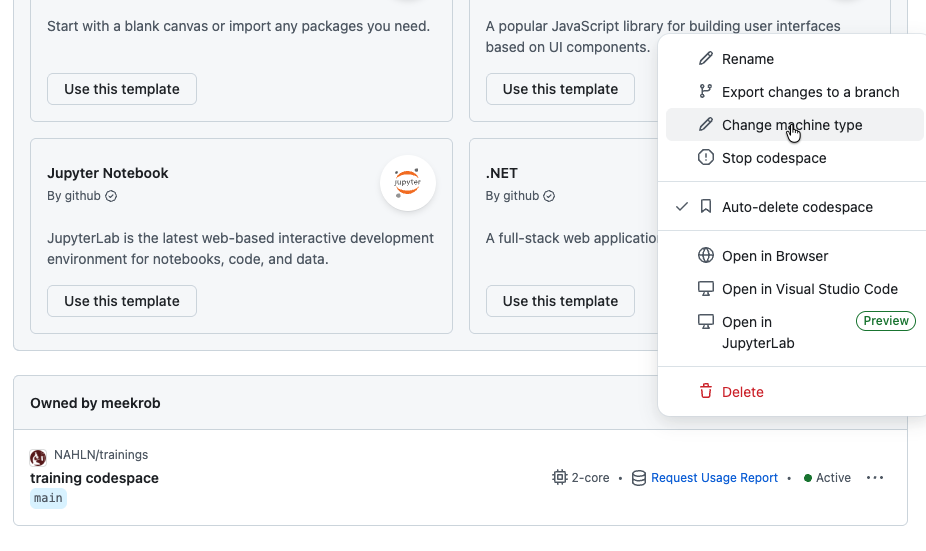
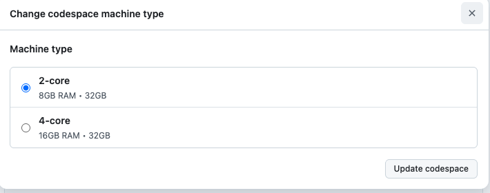

## GitHub Codespaces

A codespace is a virtual server running on Microsoft Azure.  It is ideal for light computational tasks, such as these trainings.  

### Free usage

The free usage tier offers 120 hours of free computation per month (2 cores), or 60 hours (4 cores).  The monthly time limit can also run out if the environment exceeds 15GB (ours is ~18).  Therefore, the free allocation runs out in about 25 days of a 30 day month. Additional time can be purchased for a little over $1.00.

### Status: Running, stopped, and deleted

You will see terminology used referring to the Codespace as an *Instance*. It refers to the Codespace being an *instance* of a predefined virtual machine. 

| Instance Status | CPU resources billed | Disk space resources billed |
| ----------   | -------- | -------- |
| Running | Yes | Yes |
| Stopped | No  | Yes |
| Deleted | No  | No  |

Therefore, deleting a Codespace while you're not using it will free up the resources and extend your free tier.  However, if you decide to use it again, ***your changes will be lost.***

### Managing the Codespace

To see your Codespace usage, go to [www.github.com/codespaces](https://www.github.com/codespaces) where you can get a usage report and change settings on the codespace.

#### Increasing resources

If you want more compute power, you can increase the cores to 4 and the memory to 16 Gb. This will make large computational tasks more attenable, such as assembly and phylogenetic identification with kraken (Metagenomics analysis training).

To change resources on an instance use the ellipsis (⋯) by the codespace and select **change machine type.**

**Two options are currently available:**

*Note: 32Gb is the maximum storage capacity, and is not adjustable.*