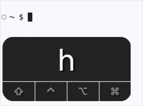
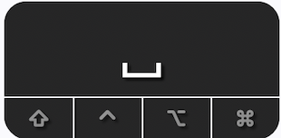
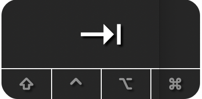
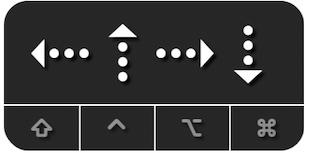

## To show when keys are pressed, some images may show the keycastr window.

### Example:

 

### Non-printing key chart

| key   | symbol       |     keycaster                                           |
|-------|--------------|---------------------------------------------------------|
| Space |<kbd>⎵</kbd>  |  |
| tab   |<kbd>⇥</kbd>  |  |
| Arrow keys | <kbd>←</kbd><kbd>↑</kbd> <kbd>→</kbd> <kbd>↓</kbd> |  |