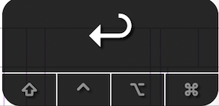
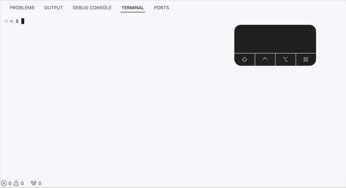

## To show when keys are pressed, some images may show the keycastr window.

### Example:

 

### Non-printing key chart

| key   | symbol       |     keycaster                                           |
|-------|--------------|---------------------------------------------------------|
| Space |<kbd>⎵</kbd>  |  |
| tab   |<kbd>⇥</kbd>  |  |
| Arrow keys | <kbd>←</kbd><kbd>↑</kbd> <kbd>→</kbd> <kbd>↓</kbd> |  |
| Enter/return | <kbd>↵</kbd> |  |

### Example: Navigating `man ls`

#### Play-by-play:

* `man ls` <kbd>↵</kbd>
* <kbd>⎵</kbd> <kbd>⎵</kbd> : space bar twice (page down twice)
* <kbd>b</kbd> <kbd>b</kbd> : press <kbd>b</kbd> to (page backward twice)
* <kbd>G</kbd> : Capital 'G' go to bottom of document
* <kbd>g</kbd> : Lowercase 'g' go to top of document
* <kbd>q</kbd> : 'q' to quit